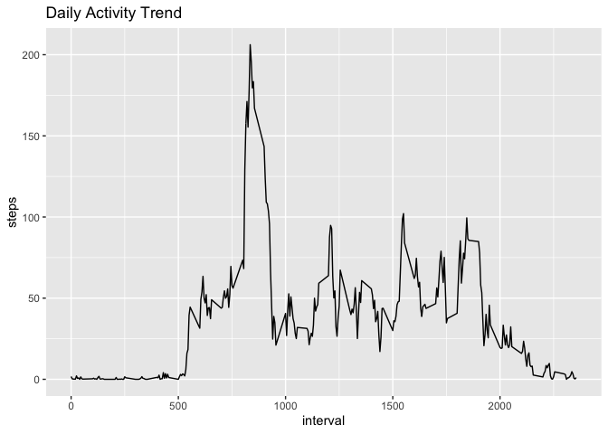

## Loading and preprocessing the data

```r
library(dplyr)
```

```
## 
## Attaching package: 'dplyr'
```

```
## The following objects are masked from 'package:stats':
## 
##     filter, lag
```

```
## The following objects are masked from 'package:base':
## 
##     intersect, setdiff, setequal, union
```

```r
##Download Data
fileURL <- "https://d396qusza40orc.cloudfront.net/repdata%2Fdata%2Factivity.zip"
temp <- tempfile()
download.file(fileURL, temp, method="curl")
unzip(temp)

activityRaw <- read.csv("activity.csv", sep = ",", header = TRUE, stringsAsFactors = FALSE)

activityRaw$date <- as.Date(activityRaw$date, "%Y-%m-%d")

byDate <- activityRaw %>% 
    select(date, steps) %>%
    group_by(date) %>%
    summarize(total_steps = sum(steps))

justSteps <- activityRaw %>% 
    select(date, steps)

justIntervals <- activityRaw %>%
    select(interval, steps) %>%
    group_by(interval) %>%
    summarize(steps = mean(steps, na.rm = TRUE))
```
## What is mean total number of steps taken per day?


```r
library(ggplot2)

stepHist <- ggplot(byDate, aes(x=date, y = total_steps))

stepHist <- stepHist + geom_bar(stat = "identity") + 
    labs(title = "Total Steps per Day") 

print(stepHist)
```

```
## Warning: Removed 8 rows containing missing values (position_stack).
```

<!-- -->

```r
meanSteps <- mean(byDate$total_steps, na.rm = TRUE)

medianSteps <-median(byDate$total_steps, na.rm = TRUE)
```
The mean number of daily steps is 1.0766189\times 10^{4}.  
The median number of daily steps is 10765.

## What is the average daily activity pattern?


```r
qplot(interval, steps, data = justIntervals, geom = "line", main = "Daily Activity Trend")
```

<!-- -->

```r
maxActivity <- justIntervals[justIntervals$steps == max(justIntervals$steps),]
```

The five minute interval with highest average number of steps is 835.

## Imputing missing values


## Are there differences in activity patterns between weekdays and weekends?
