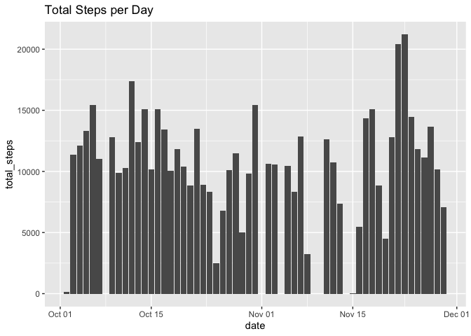
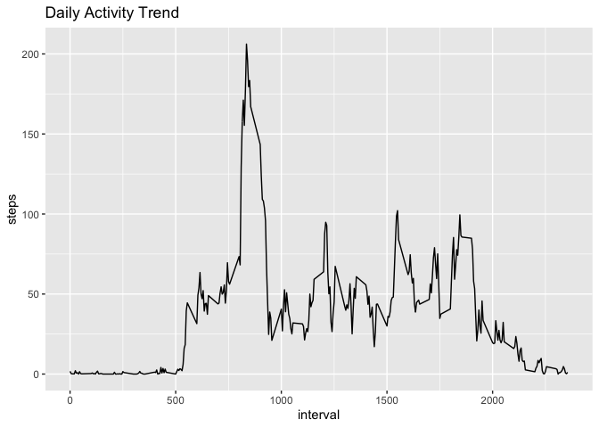
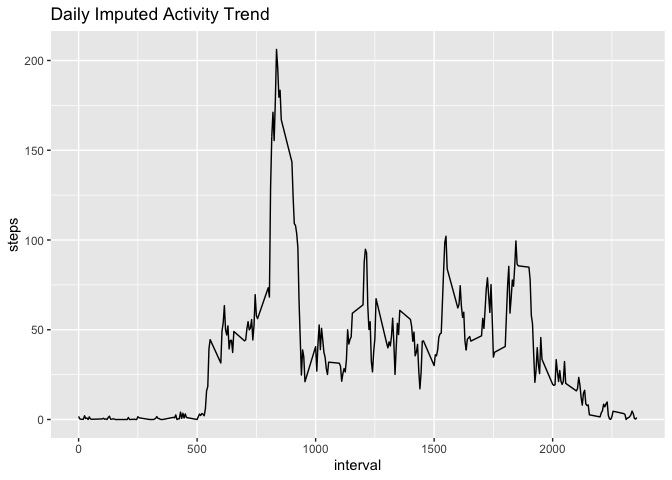
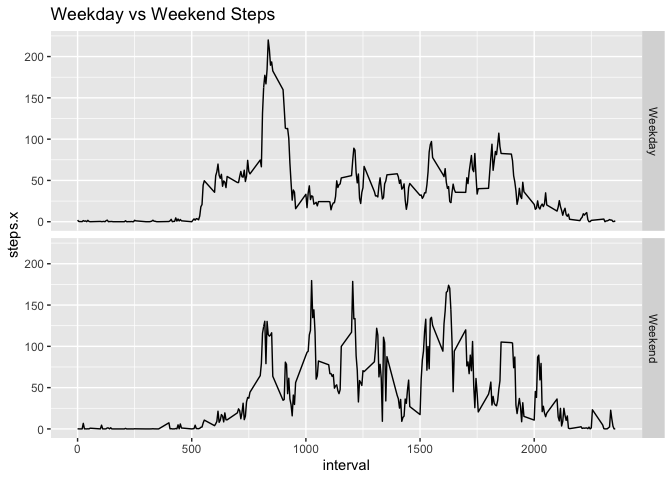

## Loading and preprocessing the data

```r
library(dplyr)
```

```
## 
## Attaching package: 'dplyr'
```

```
## The following objects are masked from 'package:stats':
## 
##     filter, lag
```

```
## The following objects are masked from 'package:base':
## 
##     intersect, setdiff, setequal, union
```

```r
library(ggplot2)

##Download Data
fileURL <- "https://d396qusza40orc.cloudfront.net/repdata%2Fdata%2Factivity.zip"
temp <- tempfile()
download.file(fileURL, temp, method="curl")
unzip(temp)

activityRaw <- read.csv("activity.csv", sep = ",", header = TRUE, stringsAsFactors = FALSE)

activityRaw$date <- as.Date(activityRaw$date, "%Y-%m-%d")
```
## What is mean total number of steps taken per day?


```r
byDate <- activityRaw %>% 
    select(date, steps) %>%
    group_by(date) %>%
    summarize(total_steps = sum(steps))

stepHist <- ggplot(byDate, aes(x=date, y = total_steps))

stepHist <- stepHist + geom_bar(stat = "identity") + 
    labs(title = "Total Steps per Day") 

print(stepHist)
```

```
## Warning: Removed 8 rows containing missing values (position_stack).
```

<!-- -->

```r
meanSteps <- as.integer(mean(byDate$total_steps, na.rm = TRUE))

medianSteps <-median(byDate$total_steps, na.rm = TRUE)
```
The mean number of daily steps is 10766.  
The median number of daily steps is 10765.

## What is the average daily activity pattern?

### Calculation


```r
justIntervals <- activityRaw %>%
    select(interval, steps) %>%
    group_by(interval) %>%
    summarize(steps = mean(steps, na.rm = TRUE))

maxActivity <- justIntervals[justIntervals$steps == max(justIntervals$steps),]
```

### Plot


```r
qplot(interval, steps, data = justIntervals, geom = "line", main = "Daily Activity Trend")
```

<!-- -->


The five minute interval with highest average number of steps is 835.

## Imputing missing values

### Calculation
If a value is missing, substitute mean steps for that interval period.


```r
##count NAs

naCount <- sum(is.na(activityRaw$steps))

##create a new data frame subsituting NAs with average value for an interval

activityImputed <- left_join (activityRaw, justIntervals, by = c("interval" = "interval")) %>%
    mutate(steps.x = ifelse(is.na(steps.x), steps.y,steps.x))

##update per day dataset
byDateImputed <- activityImputed %>% 
    select(date, steps.x) %>%
    group_by(date) %>%
    summarize(total_steps = sum(steps.x))


##and update the just interval data set
justImputedIntervals <- activityImputed %>%
    select(interval, steps.x) %>%
    group_by(interval) %>%
    summarize(steps = mean(steps.x, na.rm = TRUE))
```
### Plot

```r
##plot 'er up
qplot(interval, steps, data = justImputedIntervals, geom = "line", 
      main = "Daily Imputed Activity Trend")
```

<!-- -->

### Mean and Median Calculation


```r
#calc mean and median

meanImputedSteps <- as.integer(mean(byDateImputed$total_steps))

medianImputedSteps <- as.integer(median(byDateImputed$total_steps))
```

The number of missing step values from the data set is 2304.  
The mean number of daily steps is 10766.    
The median number of daily steps is 10766.  

## Are there differences in activity patterns between weekdays and weekends?

### Calculation


```r
##update per day dataset to factor weekday / weekend

dayActivityImputed <-activityImputed %>%
    mutate(day = weekdays(date)) %>%
    mutate(day = ifelse(day == "Saturday", "Weekend",day)) %>%
    mutate(day = ifelse(day == "Sunday", "Weekend","Weekday")) %>%
    mutate(day = factor(day)) %>%
    group_by(day, interval) %>%
    summarize(steps.x = mean(steps.x))
```

### Plot


```r
##do the plotin'
qplot(interval, steps.x, data = dayActivityImputed, facets = day ~., geom = "line", 
      main = "Weekday vs Weekend Steps")
```

<!-- -->


